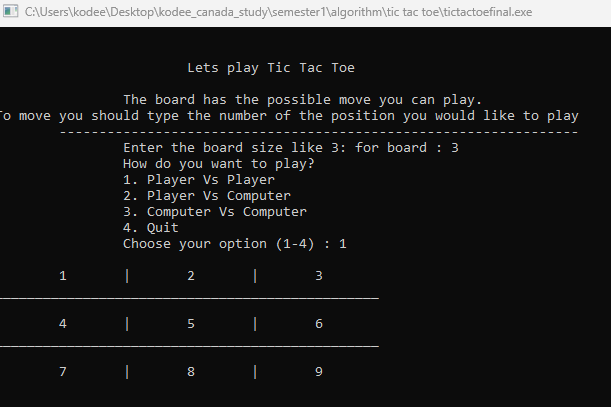

### Features

 - This tic tac toe game has three level one is player vs player,  player vs computer and computer vs computer.
 - Player vs Player is implemented using multi dimentional array concept of C.
 - In this game player can choose their grid size before starting game like 3X3, 4X4 and so on.
 - Everytime it updates player move on the position which player enters.
 - There are four winning condition if one of them satisfied then game will display the winner.
 - Random function in C is used to implement computer vs player and computer vs computer mode.

 ### Screenshot
 